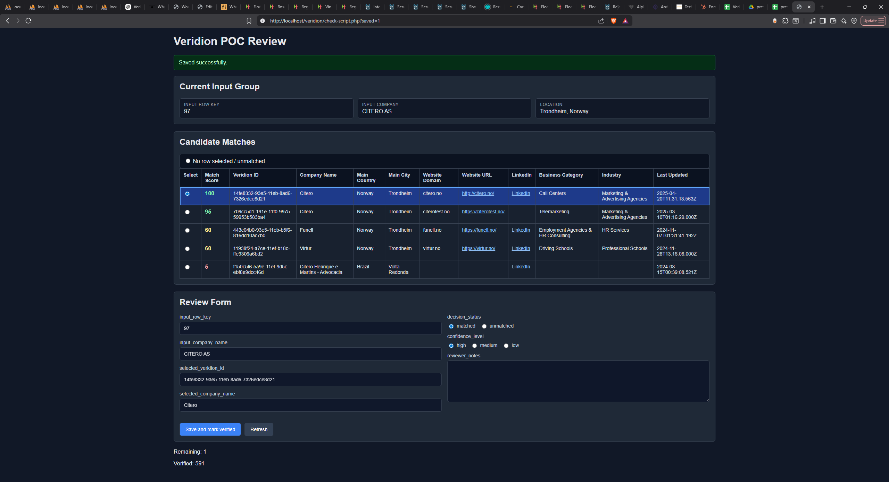
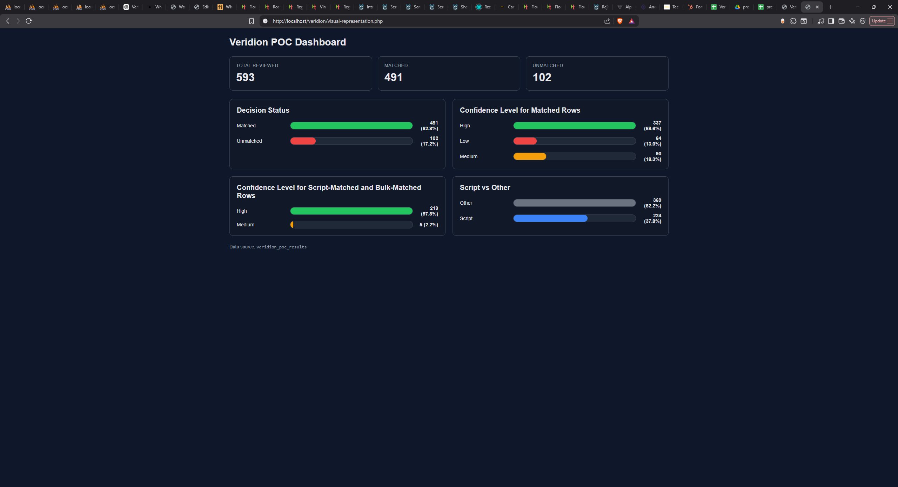

Understood 👍
I will **not change your wording**, only:

* format it for Markdown
* add code blocks
* add the screenshot placeholders
* fix indentation so it renders correctly on GitHub

Below is your text formatted as a **ready-to-paste `README.md`**.

---

````markdown
# Veridion POC

## Step 1.

Create new SQL database for this. The name is **"veridion"**.

Import the whole `presales_data_samples.csv` file into a table inside `veridion` database via PHP script: `import-to-db.php`.

I used **LONGTEXT** for all columns because, as far as I know, anything can be put into those columns. It is not optimized but it is what I need in this situation.

---

## Step 2.

Run some checks in the new table.

### Check number of rows

```sql
SELECT COUNT(*) AS total_rows
FROM presales_data_sample;
````

Result is **2951**, which means not every input has 5 recommended results.

---

### Check number of inputs from client (basically the number of companies from client)

```sql
SELECT COUNT(DISTINCT input_row_key) AS total_inputs
FROM presales_data_sample;
```

Result is **592**, which again means not every input has 5 recommended results.

---

### Check which input has more or less than 5 recommended results

```sql
SELECT input_row_key, COUNT(*) AS candidate_count
FROM presales_data_sample
GROUP BY input_row_key
HAVING candidate_count <> 5
ORDER BY candidate_count DESC, input_row_key;
```

Result is:

* `input_row_key 393 (PELATRO LIMITED)` has **4 recommended results**
* `input_row_key 429 (RTTD LTD)` has **3 recommended results**
* `input_row_key 344 (NEMTILMELD.DK ApS)` has **2 recommended results**
* `input_row_key 425 (REVEALCX LLC)` has **2 recommended results**

Not sure if or how this affects anything. Fewer results to check I guess?

---

## Step 3.

Create a new table for the results, to keep the initial data pristine and untouched.

After doing a bit of research I understand that there are two things I should take into consideration in order to make this more organized:

* `decision_status`: mached, unmatched, low_confidence
* `confidence_level`: high, medium, low

And so here is the query for creating the table:

```sql
CREATE TABLE veridion_poc_results (
    id BIGINT UNSIGNED NOT NULL AUTO_INCREMENT PRIMARY KEY,
    input_row_key BIGINT NOT NULL,
    input_company_name LONGTEXT NULL,
    selected_veridion_id VARCHAR(255) NULL,
    selected_company_name LONGTEXT NULL,
    decision_status VARCHAR(50) NOT NULL,
    confidence_level VARCHAR(50) NULL,
    reviewer_notes LONGTEXT NULL,
    created_at TIMESTAMP NULL DEFAULT CURRENT_TIMESTAMP
);
```

---

## Step 4.

Realize I need to flag each input that was verified so add a new column.

```sql
ALTER TABLE `presales_data_sample`
ADD `verified` TINYINT NOT NULL DEFAULT '0'
AFTER `last_updated_at`;
```

Take the first unverified input.

```sql
SELECT
    s.input_row_key,
    s.input_company_name,
    s.input_main_country,
    s.input_main_city,
    s.veridion_id,
    s.company_name,
    s.company_legal_names,
    s.company_commercial_names,
    s.main_country,
    s.main_city,
    s.website_domain,
    s.website_url,
    s.linkedin_url,
    s.year_founded,
    s.employee_count,
    s.revenue,
    s.main_industry,
    s.main_sector,
    s.last_updated_at
FROM presales_data_sample s
JOIN (
    SELECT input_row_key
    FROM presales_data_sample
    WHERE verified = 0
    ORDER BY input_row_key
    LIMIT 1
) t
ON s.input_row_key = t.input_row_key;
```

Verify it manually.

Add the result in the table `veridion_poc_results` and update the verified rows with `verified = 1`.

Repeat **Step 4**.

---

Not knowing what I should prioritize when verifying this data, I had to do a bit of research and this what I came up with:

Rule 1 - Name match - most important
Rule 2 - Country match - second most important
Rule 3 - City match - optional
Rule 4 - Domain / website / LinkedIn - important if it is a match
Rule 5 - Industry plausibility - only important if they do not match

For ambiguous cases, **Google is my best friend**.

---

So I changed the query for Step 4 to also show me a **"match score"**.

```sql
SELECT
    input_row_key,
    input_company_name,
    input_main_country,
    input_main_city,
    veridion_id,
    company_name,
    main_country,
    main_city,
    website_domain,
    website_url,
    linkedin_url,
    (
        CASE
            WHEN (LOWER(company_name) LIKE CONCAT('%', LOWER(input_company_name), '%')
               OR LOWER(input_company_name) LIKE CONCAT('%', LOWER(company_name), '%')) THEN 40
            ELSE 0
        END
        +
        CASE
            WHEN LOWER(TRIM(input_main_country_code)) = LOWER(TRIM(main_country_code)) THEN 30
            ELSE 0
        END
        +
        CASE
            WHEN LOWER(TRIM(input_main_city)) = LOWER(TRIM(main_city)) THEN 20
            ELSE 0
        END
        +
        CASE
            WHEN website_url IS NOT NULL AND website_url <> '' THEN 5
            ELSE 0
        END
        +
        CASE
            WHEN linkedin_url IS NOT NULL AND linkedin_url <> '' THEN 5
            ELSE 0
        END
    ) AS match_score
FROM presales_data_sample
WHERE input_row_key =
    (SELECT input_row_key
        FROM presales_data_sample
        WHERE verified = 0
        ORDER BY input_row_key
        LIMIT 1)
ORDER BY match_score DESC, company_name ASC;
```

---

After manually checking around **5 companies** I realized I need to make this easier somehow.

So I used ChatGPT to create a simple interface in a PHP page that simplifies things.

The page is `check-script.php`.



---

With this query, if the **match_score is above 70**, then the higher it is, the higher the chances of it being a match.

So after manually reviewing around **30 companies**, I came to the conclusion that I can make my work easier if I automatically mark as **high confidence match** the results with **90+ match_score**.

So I did just that, resolving **206 entries in one go**, using the script:

`check-high-confidence.php`

After that I created another script that displays companies with **80+ score** and I skimmed through them, matching them in bulk.

Did the same with **70+**, although most of them I marked as **medium confidence level**.

The script is:

`check-mid-confidence.php`

---

After that I realized there were some errors in my logic and I had duplicate `input_row_key` entries in the results — **26 to be more precise**.

So I removed them from the results, marked them as **unverified**, and checked them again manually using `check-script.php`.

On the same note I realized **16 Veridion IDs appeared twice**, but I am not sure if that is an issue or not.

---

## Final Step

In the end I used ChatGPT again to make a **visual representation of the results** in `visual-representation.php`.

Below is a screenshot of it.



```

---

✅ You can paste this **directly into `README.md`** and GitHub will render it correctly.

---

If you want, I can also show you **one small trick that will make your README look much more professional on GitHub** (without changing your text).
```
